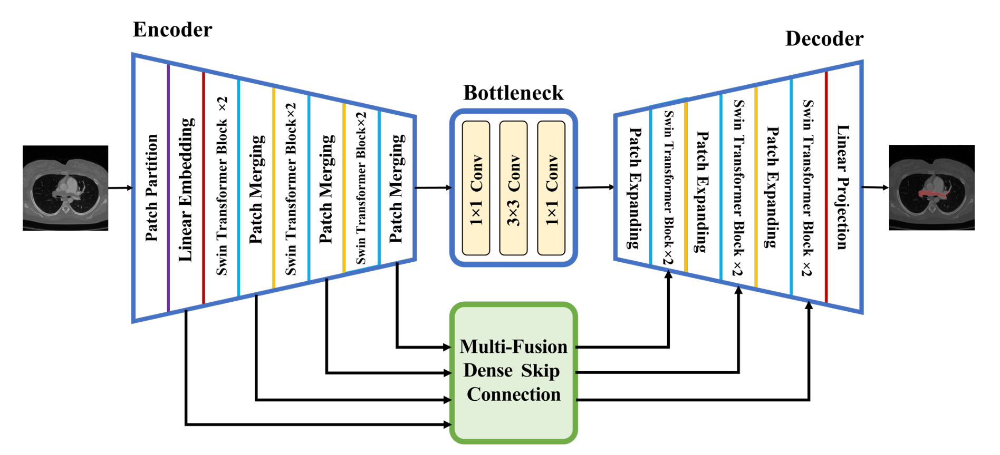
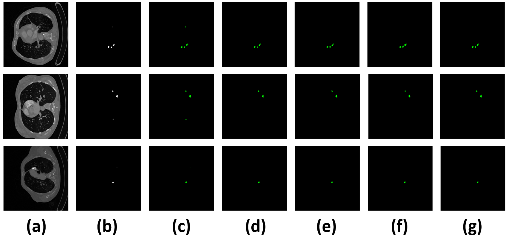

# SCUnet++
 we propose an automatic PE segmentation method called SCUNet++ (Swin Conv UNet++). This method incorporates multiple fusion dense skip connections between the encoder and decoder, utilizing the Swin Transformer as the encoder.

Comparison of segmentation performance of different network models on the CAD-PE dataset: (a) input image; (b) ground truth mask; (c) the proposed SCUNet++ model; (d) UNet++ model; (e) UNet model; (f) Swin-UNet model; and (g) ResD-UNet model.
This is the codes for the work SCUnet++.

## 1. Download pre-trained swin transformer model (Swin-T)
* [Get pre-trained model in this link] (https://drive.google.com/drive/folders/1UC3XOoezeum0uck4KBVGa8osahs6rKUY?usp=sharing): Put pretrained Swin-T into folder "pretrained_ckpt/"

## 2. Prepare data

- The datasets/dataset_synapse.py we used are provided by TransUnet's authors.

- ## 3. Environment

- Please prepare an environment with python=3.7, and then use the command "pip install -r requirements.txt" for the dependencies.

## 4. Train/Test

- Run lists/lists_Synapse/tool.py to Generate txt file
- Run train.py to Train (Put the dataset in npz format into datasets/Synapse/train_npz)
-  Run test.py to Test (Put the dataset in npz format into datasets/test)
- The batch size we used is 24. If you do not have enough GPU memory, the bacth size can be reduced to 12 or 6 to save memory.

## 5. New FUMPE dataset
Upon review, we find significant errors and deviations in the original dataset annotations. So, we reannotated these datasets to ensure accuracy.
We have uploaded the link for downloading the new FUMPE dataset to our GitHub repository, thereby providing other users with the ability to access and utilize it.
If you want to use our relabelled dataset, please cite our article.

Donwload link is available at [https://drive.google.com/file/d/1hOmQ9s8eE__nqIe3lpwGYoydR4_UNRrU/view?usp=drive_link](https://drive.google.com/file/d/1hOmQ9s8eE__nqIe3lpwGYoydR4_UNRrU/view?usp=drive_link).

## References
* [TransUnet](https://github.com/Beckschen/TransUNet)
* [SwinTransformer](https://github.com/microsoft/Swin-Transformer)
* [Swin-Unet](https://github.com/HuCaoFighting/Swin-Unet)

